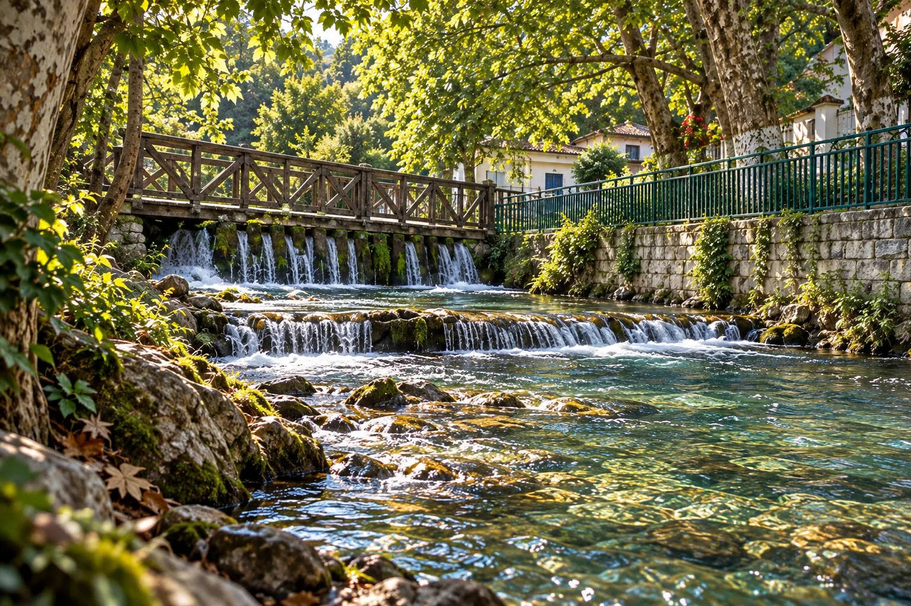
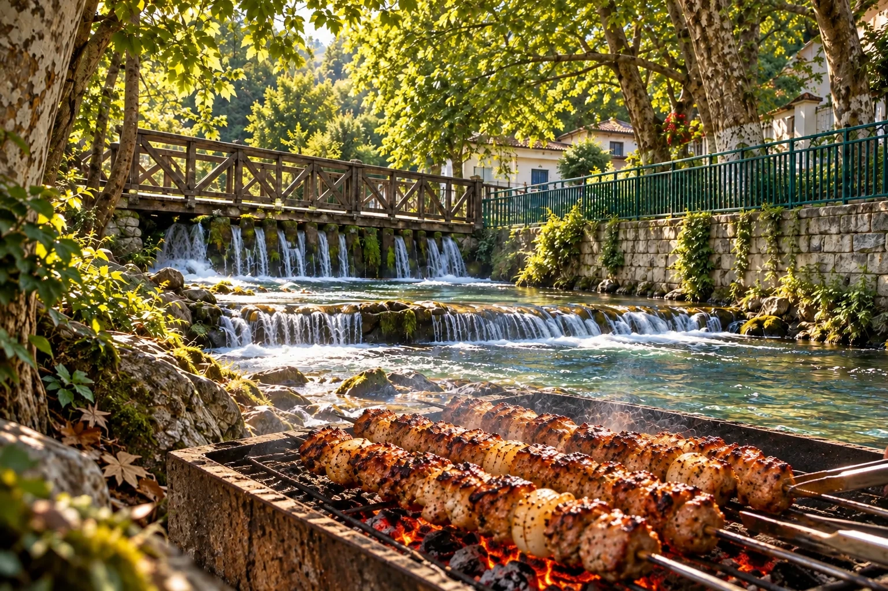
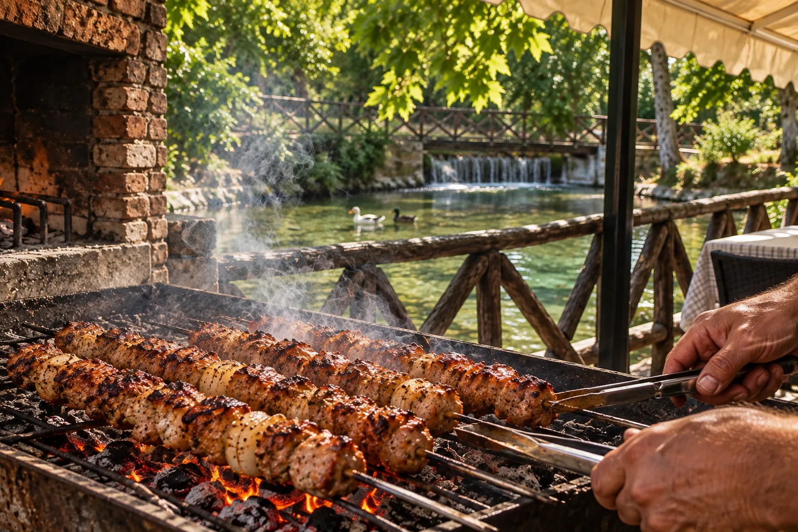
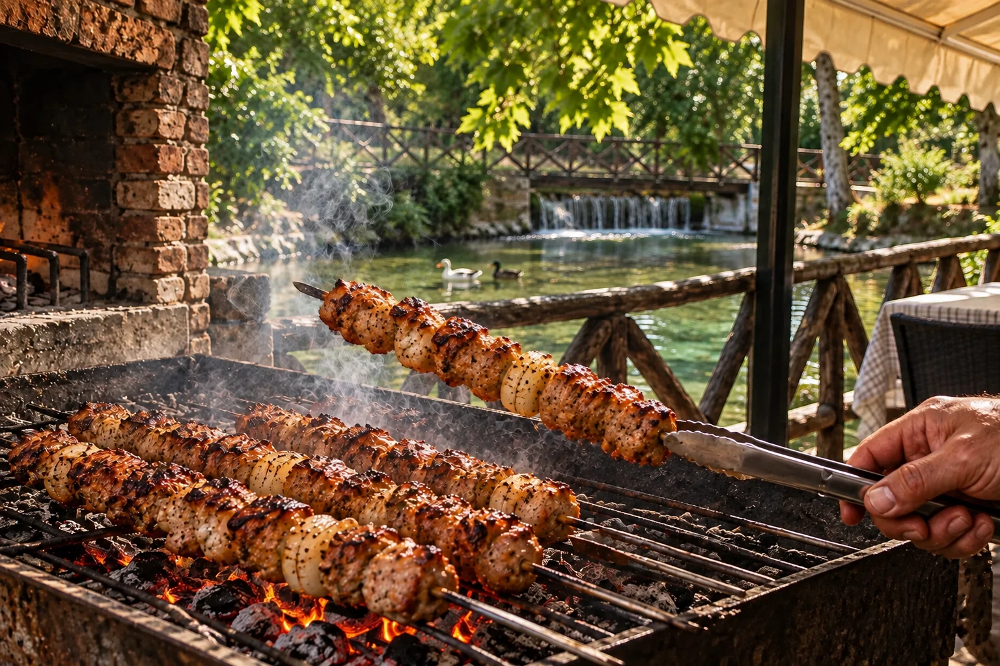
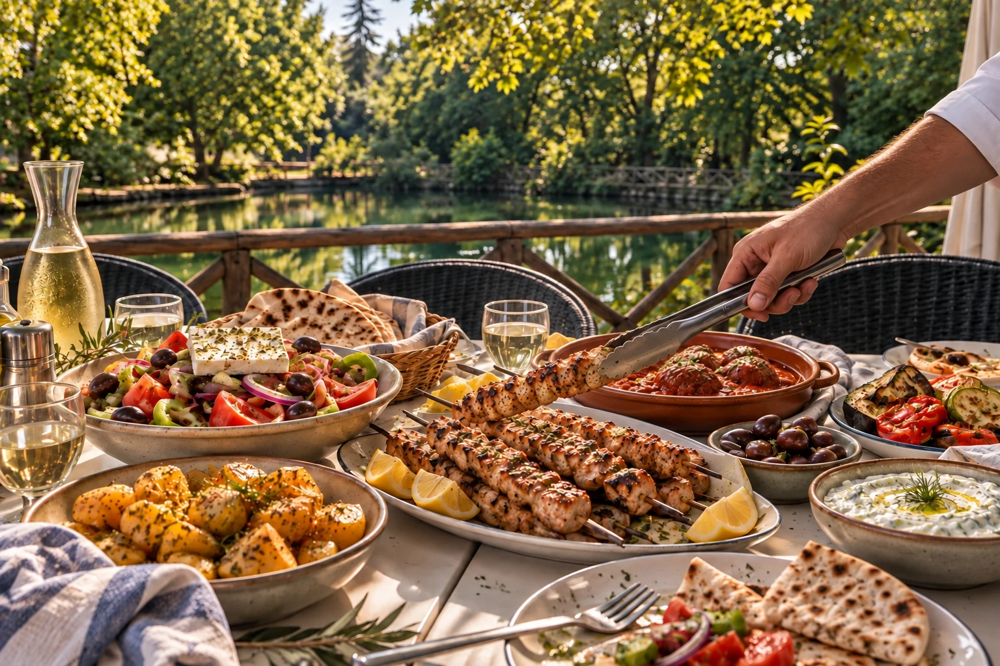
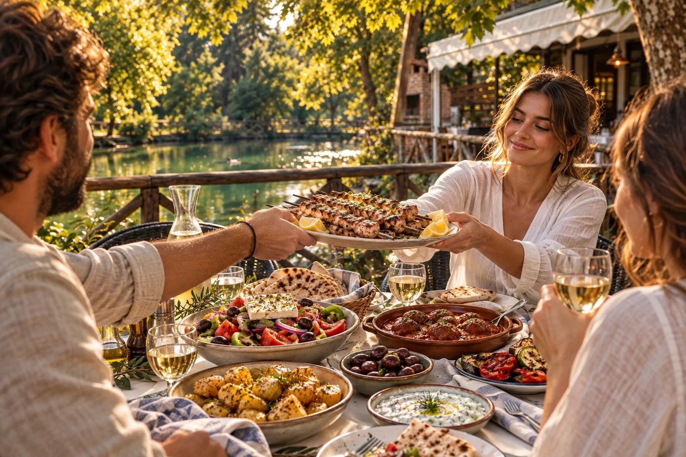

# Bildpaket · Scroll-Erzählung

Zwölf für die spätere Animation vorbereitete WebP-Keyframes: pro Kapitel ein Start- und ein Stoppbild in Desktop- und Mobilkomposition. Reihenfolge: **Wasser → Grill → Tafel → Menschen**. Der abschließende Gästemoment ist eine illustrative Szene, keine Aufnahme tatsächlicher Gäste. Die Website verwendet diese Dateien derzeit noch nicht.

## 01 · Das Wasser wird warm

| Desktop | Mobil |
| --- | --- |
| **Start** · [01-water-start.webp](frames/desktop/01-water-start.webp) · Kopie des vorhandenen `weir-editorial.webp`, die kleinen Wasserstufen und Holzbrücke. | **Start** · [01-water-start.webp](frames/mobile/01-water-start.webp) · neu komponierte Hochkantansicht auf Basis des Ortsbildes. |
| **Stopp** · [01-water-stop.webp](frames/desktop/01-water-stop.webp) · aus Wasser- und Grillreferenz neu komponiert; Grill und Spieße treten in den Vordergrund. | **Stopp** · [01-water-stop.webp](frames/mobile/01-water-stop.webp) · dieselbe Hochkantperspektive mit eintretendem Grill. |

## 02 · Souvlakia kommen vom Grill

| Desktop | Mobil |
| --- | --- |
| **Start** · [02-grill-start.webp](frames/desktop/02-grill-start.webp) · Kopie des vorhandenen `grill-editorial.webp`. | **Start** · [02-grill-start.webp](frames/mobile/02-grill-start.webp) · ortstreue Hochkantkomposition mit Grill, Brücke, Enten und Teich. |
| **Stopp** · [02-grill-stop.webp](frames/desktop/02-grill-stop.webp) · ein fertiger Spieß wird mit der Zange angehoben. | **Stopp** · [02-grill-stop.webp](frames/mobile/02-grill-stop.webp) · derselbe Handlungspunkt im mobilen Ausschnitt. |

## 03 · Der Tisch wird gemeinsam

| Desktop | Mobil |
| --- | --- |
| **Start** · [03-table-start.webp](frames/desktop/03-table-start.webp) · der fertige Spieß wird auf eine große Platte an der Tafel gelegt. | **Start** · [03-table-start.webp](frames/mobile/03-table-start.webp) · dieselbe großzügige Speisenszene für Hochkant. |
| **Stopp** · [03-table-stop.webp](frames/desktop/03-table-stop.webp) · drei illustrative Erwachsene teilen die Platte am Wasser. | **Stopp** · [03-table-stop.webp](frames/mobile/03-table-stop.webp) · mobile Fassung mit Menschen, Essen, Geländer und Teich im Bild. |

## Kontinuität und Einbau

- Die Bilder haben **keine eingebrannte Schrift**; die kurzen EL/EN/DE-Texte werden als HTML darüber gesetzt.
- Desktop: 1536 × 1024 px; Mobil: 940–941 × 1672 px (nahe 9:16). Es sind bewusst eigene Kompositionen, keine automatischen Ausschnitte.
- 01 Wasser: nur die beiden Bilder derselben Ansicht langsam verschieben und weich ineinander maskieren. Danach zur nahen Grillperspektive überleiten.
- 02 Grill: den angehobenen Spieß als Bewegungsanker nutzen. Der Übergang zum Tisch ist ein gerichteter Match-Cut über Spieß und Zange, **kein** Versuch, Steine oder Gesichter pixelweise zu morphen.
- 03 Tisch: zuerst das servierte Essen ruhig halten, dann Hände und Menschen einblenden. Den Schlussframe stabil stehen lassen, bevor die reguläre Speisenstrecke folgt.
- Die Frames stammen aus den bereits bearbeiteten Orts-, Grill-, Tisch- und Terrassenmotiven des Projekts. Die zwei kopierten Starts sind identisch mit `assets/limni/weir-editorial.webp` und `assets/limni/grill-editorial.webp`; die übrigen zehn sind neue illustrative Kompositionen aus diesen Referenzen. Herkunft der Ausgangsbilder: [`../ASSET_PROVENANCE.md`](../ASSET_PROVENANCE.md).
- Diese Keyframes dokumentieren eine **Bildidee**, keine tatsächlich gefilmte Zubereitung, keine echten Gäste und keine bestätigte aktuelle Speisekarte. Die vorhandene Kennzeichnung illustrativer Motive auf der Website bei der Einbindung beibehalten.

## Abnahmegrenze

Die Bildfolge wurde als Standbild geprüft. Bevor sie live eingesetzt wird, müssen Übergänge, Textkontrast, vorwärts/rückwärts scrollen und die tatsächliche mobile Wirkung auf einem Gerät geprüft werden. Bis dahin bleibt die veröffentlichte Website unverändert.
